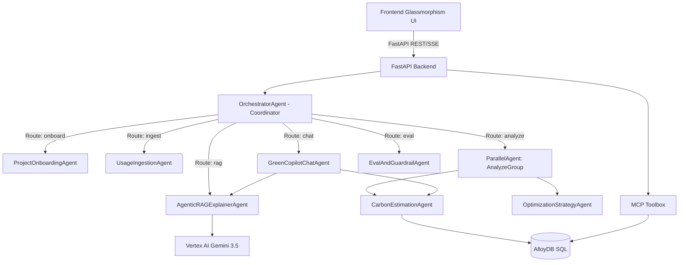

# Architecture Document

**VerdaTraceAI** is a production-ready, multi-agent, Google Cloud-native carbon intelligence copilot for AI workloads.

---

## 1. System Overview & Core Philosophy

VerdaTraceAI is built to address the hidden carbon footprint (CO₂e) of large language models and multi-modal AI systems. It follows the principles of green software engineering:
1. **Carbon Awareness**: Shifting workloads from high-intensity grids to low-intensity grids (e.g., matching clean energy times/regions).
2. **Resource Efficiency**: Reducing token consumption via semantic context caching.
3. **Decoupled Architecture**: Abstracting model calls (multi-LLM agnostic) and database interactions (MCP toolbox) from core agent routing.

---

## 2. Multi-Agent Orchestration (ADK)

The agent mesh is structured hierarchically using the **Google Agent Development Kit (ADK)**:

### Coordinator & Parallel Patterns
- **`OrchestratorAgent` (Coordinator)**: Analyzes incoming payload parameters (e.g., `intent`) and routes requests to the respective specialists.
- **`AnalyzeGroup` (ParallelAgent)**: Concurrently fires off the `CarbonEstimationAgent` and the `OptimizationStrategyAgent` using Python `asyncio.gather`, reducing turnaround latency by overlapping computation and LLM generation.

---

## 3. Carbon Footprint Mathematical Models

To make carbon footprint estimation transparent, VerdaTraceAI models emission metrics ($E$, in kg CO₂e) using the following formulas:

$$E = \frac{P \times I}{1000}$$

Where:
- $P$ is the total Power consumed in kilowatt-hours (kWh).
- $I$ is the grid carbon intensity (in gCO₂e per kWh) associated with the deployment region.
- $1000$ normalizes grams to kilograms.

### Power Calculation ($P$)
Power consumption is estimated based on compute time, token cache efficiency, and multimodal media assets:

$$P = P_{\text{compute}} + P_{\text{multimodal}}$$

1. **Inference Compute Power ($P_{\text{compute}}$)**:
   $$P_{\text{compute}} = \left( \frac{t_{\text{run}}}{1000.0} \right) \times P_{\text{baseline}}$$
   - $t_{\text{run}}$: Workload execution runtime in milliseconds.
   - $P_{\text{baseline}}$: Baseline active power of a standard GPU/TPU accelerator (modeled at $0.005$ kWh per active execution second).

2. **Multimodal Media Ingestion Overhead ($P_{\text{multimodal}}$)**:
   Depending on the media types processed by the LLM:
   - **Text**: $0.0$ kWh.
   - **Image**: $N_{\text{images}} \times 0.002$ kWh.
   - **Audio**: $t_{\text{audio}} \times 0.0005$ kWh.
   - **Video**: $t_{\text{video}} \times 0.004$ kWh (reflecting high frame extraction and batch parsing GPU costs).

### Region Grid Carbon Intensities ($I$)
Grid carbon intensity factors are mapped as follows:
- **`us-east4` (N. Virginia)**: $450$ gCO₂e/kWh (High carbon grid)
- **`us-central1` (Iowa)**: $400$ gCO₂e/kWh (Grid average)
- **`europe-west4` (Eemshaven, Netherlands)**: $50$ gCO₂e/kWh (93% Carbon-Free Energy match)

### Context Caching Coefficient ($C_{\text{cache}}$)
When Vertex AI Context Caching or Semantic Caching is enabled:
- A multiplier of $0.6$ is applied to the final effective token count ($40\%$ energy saving on token retrieval), which directly reduces GPU processor overhead.

---

## 4. Multi-LLM Agnostic Provider Architecture

VerdaTraceAI decouples agent logic from specific API SDKs using an agnostic model service:
- **`llm_service.py`**: Intercepts queries and routes them based on the `LLM_PROVIDER` environment variable (`vertex-ai`, `openai`, `anthropic`).
- **`AgnosticModel`**: A shim wrapper class that mimics Vertex AI generative models. It intercepts prompts, normalizes responses, and injects multilingual support, ensuring that the application remains fully functional even in offline or local mock modes.

---

## 5. Multilingual & Multimodal Support

### Multilingual Support
All specialist agents (like `AgenticRAGExplainerAgent` and `GreenCopilotChatAgent`) include strict language instruction tags in their prompts. The system auto-detects Spanish, French, German, or English inputs and instructs the LLM provider to reply in the user's corresponding language.

### Multimodal Input Handling
The frontend and backend accept file indicators (`media_type`, `media_count`, `media_duration_sec`). The `UsageIngestionAgent` records this telemetry, allowing `CarbonEstimationAgent` to dynamically scale the power consumption metrics.

