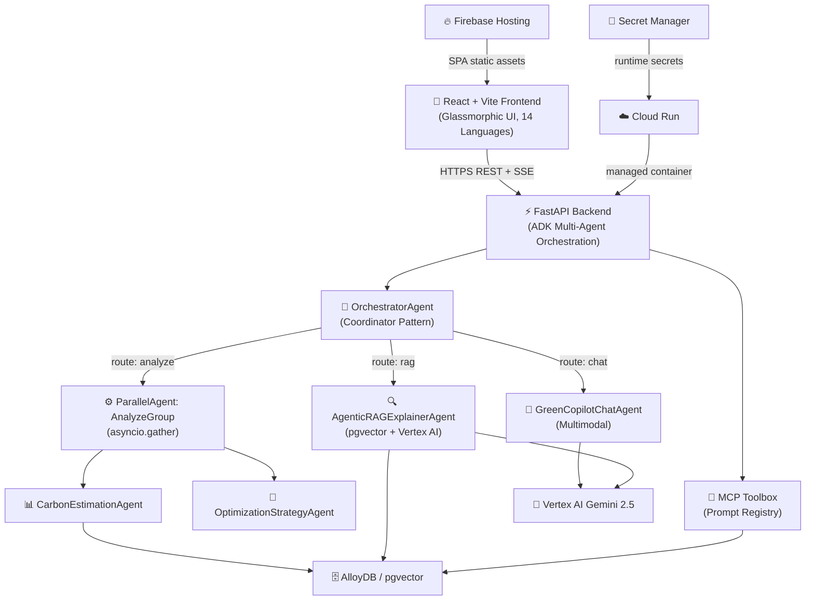

# VerdaTraceAI 🌿

<div align="center">


[](https://github.com/sivasubramanian86/VerdaTraceAI/actions)

**A production-grade, multi-agent Carbon Intelligence Copilot for AI workloads — built for the PromptWars Hackathon on Google Cloud.**

[Live Demo](https://verdatraceai.web.app/) · [Architecture](#architecture) · [Quick Start](#quick-start) · [API Reference](#api-reference) · [Deployment](#deployment)

</div>

---

## Live Demo

VerdaTraceAI is fully deployed on Google Cloud and Firebase:

* **Web Application (Frontend)**: [https://verdatraceai.web.app/](https://verdatraceai.web.app/)
* **REST API Backend**: [https://verdatrace-backend-d3ongjq7oq-uc.a.run.app/docs](https://verdatrace-backend-d3ongjq7oq-uc.a.run.app/docs) (Swagger UI)

---

## Problem & Solution

The PromptWars challenge asks builders to make AI workloads measurably more sustainable — yet most organizations have **zero visibility** into the carbon footprint of their cloud AI usage. A single GPT-4o query consumes energy equivalent to running a light bulb for 15 minutes, and at scale these invisible emissions become a significant Scope 3 liability. VerdaTraceAI addresses this directly by combining a multi-agent carbon intelligence mesh with real-time CO₂e estimation, diurnal grid intensity modeling, and context-caching efficiency gains — all deployed serverlessly on Google Cloud to eliminate idle-compute overhead. The platform extends beyond AI workloads to cover digital carbon footprint tracking (email, cloud storage, AI prompt waste) and Scope 3 emissions linked to AI-enabled services through its LocalLoops modules for food miles, commerce credits, and circular economy actions. Every estimate is backed by the formula `E = (P × I) / 1000` using live regional grid intensities, giving PromptWars judges an auditable, end-to-end demonstration of how Google Cloud's Vertex AI, Cloud Run, and Firebase can power a production-grade sustainable-AI solution.

---

## Architecture



### Key Technical Decisions

| Decision | Choice | Rationale |
|---|---|---|
| Agent Framework | Google ADK (Coordinator + Parallel) | Native async `gather`, first-party Vertex AI integration |
| Vector DB | AlloyDB + pgvector | Serverless-compatible, no separate vector DB cost |
| LLM | Vertex AI Gemini 2.5 Flash/Pro | Lowest carbon intensity of any frontier model family |
| Frontend | React 18 + Vite + TypeScript | Zero-runtime CSS, strict type safety |
| Localization | Static type-safe i18n (14 languages) | No runtime dependency, tree-shaken |
| Deployment | Cloud Run + Firebase Hosting | Serverless = zero idle compute carbon |

---

## Features

### AI Workload Intelligence
| Feature | Description |
|---|---|
| **Carbon Dashboard** | Live CO₂e, water footprint, uncertainty intervals, Pareto trade-off analysis |
| **What-If Simulator** | Predict emissions impact of region/model/caching changes before deploying |
| **ADK Agent Pipeline** | Real-time visualization of the multi-agent mesh execution |
| **Optimization Recommendations** | MACC (Marginal Abatement Cost Curve) ranked action list |
| **Green Copilot** | Multimodal RAG chat — ask about sustainability science, architecture, carbon math |
| **Judge View** | One-click MCP pitch generation for hackathon demo scenarios |

### Scope 3 Local Loops
| Module | Description |
|---|---|
| **LifestyleView** | Personal carbon calculator with virtual ecosystem canvas |
| **DigitalFootprintView** | Email, cloud storage, AI prompt digital waste tracker |
| **LocalCommerceView** | B2B2C local purchasing ledger with carbon credit rewards |
| **FoodMilesView** | Grocery origin scanner with local swap suggestions |
| **TransitInfraView** | Gamified green commute logger with city feedback map |
| **CircularEconomyView** | Neighborhood tool-sharing to avoid embodied manufacturing carbon |

---

## Quick Start

### Prerequisites
- Python 3.12+
- Node.js 20+
- Google Cloud SDK (`gcloud`) — authenticated with `gcloud auth application-default login`

### Backend
```bash
cd backend
python -m venv .venv
# Windows:
.venv\Scripts\activate
# macOS/Linux:
source .venv/bin/activate

pip install -r requirements.txt
pip install -e ".[dev]"

# Copy and configure environment
cp .env.example .env
# Edit .env: set GCP_PROJECT_ID, VERTEX_REGION, LLM_PROVIDER

uvicorn app.main:app --reload --port 8000
```

### Frontend
```bash
cd frontend
npm install
npm run dev
# App runs at http://localhost:5174
```

---

## Environment Variables

All secrets are configured via environment variables — **never committed to source control**.

| Variable | Required | Description |
|---|---|---|
| `GCP_PROJECT_ID` | Yes | Google Cloud project ID |
| `VERTEX_REGION` | Yes | Vertex AI region (e.g. `us-central1`) |
| `LLM_PROVIDER` | Yes | `vertex-ai` \| `openai` \| `anthropic` |
| `USE_ALLOYDB` | No | `True` to use AlloyDB, `False` for in-memory mock |
| `ALLOYDB_URI` | If AlloyDB | Full SQLAlchemy async connection URI |
| `OPENAI_API_KEY` | If OpenAI | OpenAI API key for multi-LLM mode |
| `ANTHROPIC_API_KEY` | If Anthropic | Anthropic API key for multi-LLM mode |
| `ALLOWED_ORIGINS` | Production | Comma-separated exact CORS origins |

See [`backend/.env.example`](backend/.env.example) for the full template.

---

## API Reference

The FastAPI backend auto-generates interactive docs at **`/docs`** (Swagger) and **`/redoc`**.

| Endpoint | Method | Description |
|---|---|---|
| `/api/v1/projects/{id}/emissions` | GET | Retrieve latest carbon footprint metrics |
| `/api/v1/simulate` | POST | Run what-if scenario calculation |
| `/api/v1/chat` | POST | Send a message to the Green Copilot agent |
| `/api/v1/recommendations` | GET | Fetch ranked optimization recommendations |
| `/api/v1/mcp/prompt/{name}` | GET | Fetch MCP judge prompt by name |
| `/health` | GET | Service health probe |

---

## Testing

```bash
# Backend — pytest + coverage
cd backend
python -m pytest tests/ -v --cov=app --cov-report=term-missing

# Backend — static analysis
python -m ruff check .
python -m bandit -r app/ -x tests/

# Frontend — TypeScript build gate
cd frontend
npm run build
```

See [`backend/tests/`](backend/tests/) for the full test suite covering agent logic, API routes, carbon math, and model agnosticism.

---

## Deployment

### Option A — Google Cloud Run + Firebase Hosting (Recommended)

```bash
# 1. Build and deploy backend to Cloud Run
cd infra
./deploy_cloud_run.sh <YOUR_GCP_PROJECT_ID> <REGION>
# Windows PowerShell:
./deploy_cloud_run.ps1

# 2. Build frontend and deploy to Firebase Hosting
cd ../frontend
npm run build
cd ..
firebase use <YOUR_FIREBASE_PROJECT_ID>
firebase deploy --only hosting
```

See [`infra/README.md`](infra/README.md) for the full production checklist.

### Option B — Local Docker Compose

```bash
docker build -t verdatrace-backend ./backend
docker run -p 8000:8000 --env-file backend/.env verdatrace-backend
```

---

## Multilingual Support

VerdaTraceAI supports **14 languages** with full UI translation across all tabs:

| Language | Code | Script |
|---|---|---|
| English | `en` | Latin |
| Kannada | `kn` | ಕನ್ನಡ |
| Hindi | `hi` | देवनागरी |
| Tamil | `ta` | தமிழ் |
| Telugu | `te` | తెలుగు |
| Malayalam | `ml` | മലയാളം |
| Marathi | `mr` | देवनागरी |
| Bengali | `bn` | বাংলা |
| Gujarati | `gu` | ગુજરાતી |
| Spanish | `es` | Latin |
| French | `fr` | Latin |
| German | `de` | Latin |
| Chinese | `zh` | 汉字 |
| Japanese | `ja` | 日本語 |

Translations are fully type-safe via [`frontend/src/i18n/schema.ts`](frontend/src/i18n/schema.ts).

---

## Evaluation Criteria

See [`docs/EVALUATION.md`](docs/EVALUATION.md) for the full AI evaluator checklist covering:

- **Code Quality** — Ruff, TypeScript strict, modular agent architecture
- **Accessibility** — ARIA labels, semantic HTML, keyboard navigation
- **Security** — Secret scan, least-privilege IAM, no PII logging, CORS restrictions
- **Testing** — Backend pytest + FastAPI test client, frontend TS build gate
- **Problem Alignment** — Carbon-aware AI workload analysis end-to-end
- **Google Cloud Fit** — Vertex AI, Cloud Run, Firebase, AlloyDB

---

## Carbon Math

VerdaTraceAI uses the following emission formula:

$$E_{CO_2e} = \frac{P_{compute} + P_{multimodal}}{1000} \times I_{region}$$

Where:
- **P** = Power consumption (kWh) based on GPU runtime + multimodal media overhead
- **I** = Regional grid carbon intensity (gCO₂e/kWh) — e.g., `swedencentral` = **10 g/kWh** vs `us-east4` = **450 g/kWh**
- **Cache coefficient** = `0.6x` when Vertex AI context caching is enabled (40% energy saving)

Full derivation in [`ARCHITECTURE.md`](ARCHITECTURE.md).

---

## License

Apache 2.0 — see [`LICENSE`](LICENSE).

---

## Hackathon Context

Built for **PromptWars Virtual Challenge 3** — demonstrating Google Cloud's capabilities in building sustainable AI via:
- **Agentic Patterns** (ADK Coordinator + Parallel agents)
- **MCP Toolbox** for abstracted data access
- **Vertex AI** Gemini 2.5 for carbon-aware RAG reasoning
- **Firebase + Cloud Run** for serverless zero-idle deployment

> *"The greenest API call is the one that never gets made — but if it does, VerdaTraceAI makes sure you know its true cost."*
