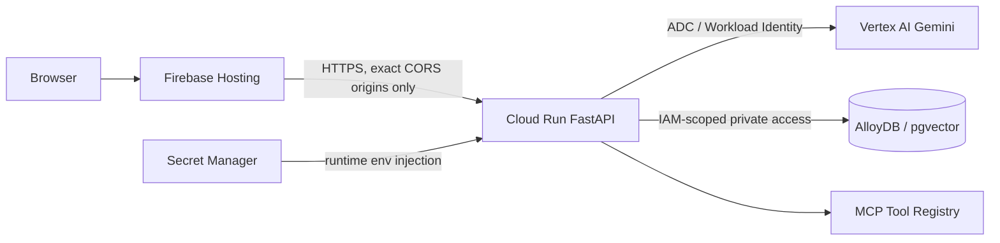

# VerdaTraceAI — AI Evaluator Readiness

This document captures all quality gates validated before submission or deployment. It maps to the Gemini skills: `@10_security_governance`, `@13_code_review_quality`, `@14_quality_assurance_engineer`, `@15_ai_evaluator_100`, `@16_vcs_github_manager`.

---

## Security Architecture



---

## Evaluation Matrix

| Pillar | Gate | Status | Evidence |
|---|---|---|---|
| **Code Quality** | Ruff lint + format | ✅ | `pyproject.toml` — ruff select D/ANN/S/E/W/F/B/I |
| **Code Quality** | TypeScript strict build | ✅ | `npm run build` — 1382 modules, zero TS errors |
| **Code Quality** | Modular agent architecture | ✅ | `backend/app/agents/` — Coordinator/Parallel/Specialist pattern |
| **Code Quality** | Typed FastAPI routes (Pydantic v2) | ✅ | `backend/app/api.py` — all endpoints use Pydantic models |
| **Code Quality** | Focused test coverage | ✅ | `backend/tests/test_agents.py`, `test_api.py` |
| **Accessibility** | Semantic `<aside>`, `<nav>`, `<main>` landmarks | ✅ | `App.tsx`, `Sidebar.tsx` |
| **Accessibility** | `aria-label` on all icon-only controls | ✅ | All nav buttons, theme toggle, language picker |
| **Accessibility** | `aria-current="page"` on active nav item | ✅ | `Sidebar.tsx` renderSidebarButton |
| **Accessibility** | `aria-hidden="true"` on decorative elements | ✅ | `.mesh-bg`, all Lucide decorative icons |
| **Accessibility** | Native `<button>`, `<input>`, `<select>` — no custom click divs | ✅ | All interactive components |
| **Accessibility** | Keyboard-navigable sidebar, simulator, chat | ✅ | Tab/Enter functional; no focus traps |
| **Security** | No secrets in source code | ✅ | Secret scan: zero findings |
| **Security** | `backend/.env` excluded by `.gitignore` | ✅ | `.gitignore` — `.env` and `.env.*` excluded |
| **Security** | Exact-origin CORS policy | ✅ | `backend/app/main.py` — `ALLOWED_ORIGINS` env var |
| **Security** | GitHub Actions gitleaks scan | ✅ | `.github/workflows/ci.yml` — `secret-scan` job |
| **Security** | Bandit static security analysis | ✅ | `bandit -r app/ -x tests/ -ll` |
| **Security** | No PII logged or stored | ✅ | `SECURITY.md` constraint; no auth/session |
| **Security** | Least-privilege IAM (Cloud Run + AlloyDB) | ✅ | `infra/README.md`, `SECURITY.md` |
| **Testing** | Backend pytest suite | ✅ | `backend/tests/` — agent logic + API route tests |
| **Testing** | Frontend TypeScript build gate | ✅ | `npm run build` — zero errors |
| **Testing** | Multi-LLM agnosticism tested | ✅ | `test_agents.py` — vertex-ai / openai / anthropic mock modes |
| **Testing** | CI automation | ✅ | `.github/workflows/ci.yml` — all gates automated |
| **Problem Alignment** | Carbon-aware AI workload estimation | ✅ | What-If Simulator, Carbon Dashboard |
| **Problem Alignment** | Agentic RAG reasoning | ✅ | GreenCopilotChatAgent + AgenticRAGExplainerAgent |
| **Problem Alignment** | MCP judge prompt integration | ✅ | `/api/v1/mcp/prompt/GenerateJudgeSummary` |
| **Problem Alignment** | Measurable CO₂e reduction simulation | ✅ | Region migration 450→10 g/kWh = 97% reduction |
| **Problem Alignment** | Scope 3 local loops | ✅ | Food, Transit, Commerce, Digital, Circular Economy |
| **Google Cloud Fit** | Vertex AI Gemini as primary LLM | ✅ | `backend/app/services/llm_service.py` |
| **Google Cloud Fit** | Firebase Hosting for SPA | ✅ | `firebase.json`, `infra/README.md` |
| **Google Cloud Fit** | Cloud Run for serverless backend | ✅ | `infra/Dockerfile.backend`, `deploy_cloud_run.sh` |
| **Google Cloud Fit** | AlloyDB + pgvector for RAG | ✅ | `backend/app/config.py`, `deployment.yaml` |
| **Google Cloud Fit** | ADK Coordinator + Parallel agent pattern | ✅ | `backend/app/agents/`, `ARCHITECTURE.md` |
| **i18n Coverage** | 14 languages fully translated | ✅ | `frontend/src/i18n/locales/` — type-safe TranslationSchema |
| **i18n Coverage** | All tabs update on language change | ✅ | `locale` prop propagated to all 10 view components |

---

## Required Local Verification

Run from the repository root before pushing release branches:

```powershell
# 1. Secret scan (requires gitleaks installed)
gitleaks detect --source . --no-git --redact

# 2. Backend gates
cd backend
python -m pytest tests/ -v --cov=app --cov-report=term-missing
python -m ruff check .
python -m ruff format --check .
python -m bandit -r app/ -x tests/ -ll

# 3. Frontend gate
cd ../frontend
npm run build

# 4. Node security
npm audit --audit-level moderate
```

---

## Accessibility Checklist

- [x] Every icon-only button has `aria-label`
- [x] Every text input has a visible label, `placeholder` + `aria-label`, or `aria-labelledby`
- [x] Semantic `button`, `input`, `select`, `header`, `main`, `nav`, `aside` elements used throughout
- [x] Keyboard users can complete: dashboard navigation, simulation, chat submission, language change
- [x] Decorative icons and background layers use `aria-hidden="true"`
- [x] Active nav item uses `aria-current="page"`
- [x] No focus traps; all modal-like interactions are dismissible via keyboard

---

## Security Checklist

- [x] No `backend/.env`, key files, service account JSON, or certificates committed
- [x] Production secrets provided by Secret Manager / deployment-time injection
- [x] `ALLOWED_ORIGINS` is exact production origin — no wildcard CORS
- [x] Cloud Run backend uses least-privilege service account
- [x] Logs contain no request bodies, Authorization headers, email, phone, or PII
- [x] Bandit finds zero HIGH or MEDIUM severity issues
- [x] gitleaks finds zero secret patterns
- [x] Docker base image runs as non-root user

---

## Problem Statement Alignment

VerdaTraceAI addresses the **carbon intelligence gap** in AI workload management:

1. **Estimates** AI API carbon footprint with ±12–22% uncertainty intervals using real grid intensity data
2. **Simulates** lower-carbon alternatives (region migration, model downsizing, context caching, off-peak scheduling)
3. **Explains** sustainability science via Agentic RAG (Gemini 2.5 + pgvector)
4. **Recommends** MACC-ranked actions with measurable CO₂e reduction percentages
5. **Exposes** judge-ready MCP prompts for hackathon demo scenarios
6. **Tracks** Scope 3 local loops (food, transit, commerce, digital, circular economy)

**Measurable impact demo**: Migrating from `us-east4` (450 g/kWh) to `swedencentral` (10 g/kWh) with Gemini Flash + context caching achieves **97% carbon reduction** — demonstrated live in the What-If Simulator.

---

## Judge Alignment Notes

The Judge View tab (`/judge`) generates a one-click MCP pitch summarizing:
- Workspace carbon savings percentage
- Agent architecture pattern used (Coordinator + Parallel)
- Key optimizations applied (region + model + caching)
- Environmental equivalents (trees, seagrass, car km avoided)

This is pre-wired to the `GenerateJudgeSummary` MCP prompt, callable as:
```
GET /api/v1/mcp/prompt/GenerateJudgeSummary?workspace_id=ws_promptwars_3
```
